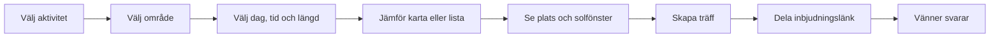

# Användarupplevelse

Status: koncept. Namn, tider och platser i exemplen är påhittade.

## Huvudflödet



## 1. Utforska

Starta i pilotområdet utan krav på konto eller positionstillstånd. Visa ”Idag”, aktuell tid och 60 minuters besök som ändringsbara förval. Be om position först när användaren trycker ”Nära mig”.

Visa ”Vad vill du göra?” med promenad, barbesök och restaurangbesök. Behåll möjligheten att utforska alla platser. Aktiviteten styr relevanta kategorier; datum, tid och längd ligger nära valet. En tidslinje kan dras i 15-minuterssteg. Det är ett navigationssteg, inte ett löfte om väderprecision.

Kartan föreslås ha ett bekant upplägg inspirerat av Google Maps: sökfält, tydliga markörer, platskort från nederkanten och växling till lista. Lägg sol/skugga som ett separat avstängningsbart lager. Vald plats och tid ska vara desamma i karta och lista; en kameraförflyttning får inte i sig ändra platsens beräknade solfönster.

Ett platskort ska kunna läsas på några sekunder:

```text
Exempelterrassen · Restaurang · 600 m fågelväg
Lördag 15.00–17.00
Möjlig direkt sol cirka 15.30–17.00 · 1 h 30 min
Väder: växlande molnighet · 19 °C
Öppettider: inte bekräftade
[Se platsen]
```

Om den geometriska modellen bara omfattar byggnader: skriv ”Träd och parasoller kan ge ytterligare skugga”. Om detta gör resultatet för osäkert ska platsen inte få etiketten hög datakvalitet.

## 2. Platsdetalj

Visa den markerade uteserveringen eller parkytan, och gör den möjlig att skilja från entrén. Visa först valt besök och sedan hela dagens solfönster. Väderspåret ligger separat under solspåret.

Använd text och mönster tillsammans med färg: möjlig direkt sol, delvis sol, skugga och okänt. En solikon får inte ensam betyda både klar himmel och frånvaro av byggnadsskugga.

Användaren kan byta dag, få ett alternativt tidsförslag och skapa en träff. En utvecklingsdetalj som modellversion hör hemma under ”Om beräkningen”, inte i det huvudsakliga beslutsflödet.

## 3. Skapa träff

Förifyll aktivitet, vald plats, yta, datum och tid. För en promenad anges också en tydlig mötespunkt i den valda parken. Värden lägger till ett visningsnamn och eventuell kort beskrivning. Visa sammanfattningen före skapandet. ”Boka en träff” betyder här att samordna vänner; någon bordsreservation görs inte.

Efter skapandet finns ”Dela inbjudan” och ”Kopiera länk”. Värdens hanteringslänk visas separat med uppmaning att spara den privat. Den ska aldrig följa med i det delade meddelandet.

Förslag på delningstext:

> Ska vi ses på Exempelterrassen på lördag 15.30? Här finns plats, tid och möjlighet att svara: [inbjudningslänk]

Produkten skickar inte meddelanden åt värden i första versionen. Delning sker genom telefonens delningsfunktion eller kopierad länk.

## 4. Svara

Inbjudningssidan visar aktivitet, värd, plats/mötespunkt, lokal tid, senaste prognos och eventuell ändring av planen. Gästen anger visningsnamn och väljer ja, kanske eller nej. Gäster ser svarssummor; värden ser namn och svar.

En privat redigeringsbehörighet sparas i gästens webbläsare. Gästidentiteten är inte verifierad. Utan konto finns ingen automatisk återställning på en ny enhet; värden kan ta bort en dubblett eller ett felaktigt svar. Den begränsningen ska beskrivas vid behov.

## 5. När förutsättningarna ändras

- **Väderprognosen ändras:** sidan visar den nya prognosen och uppdateringstid. Träffen flyttas inte automatiskt.
- **Värden ändrar aktivitet, plats/mötespunkt eller tid:** ny version av planen visas och tidigare svar markeras ”behöver bekräftas igen”. Värden uppmanas att dela länken på nytt.
- **Värden ställer in:** sidan visar inställd träff och tar inte emot nya svar.
- **Gammal länk:** samma delningslänk visar aktuell version tills den spärras eller löper ut. En spärrad länk visar inga träffdetaljer.

## Tomma och osäkra lägen

| Situation | Vad användaren ska se |
| --- | --- |
| Inga bra träffar | ”Inga platser matchar just den tiden. Prova 16.00 eller ett större område.” |
| Väder saknas | ”Väderprognos saknas. Tiderna visar när solen kan nå platsen vid klar himmel.” |
| Skuggunderlag saknas | ”Vi kan ännu inte bedöma solen på den här platsen.” Ingen uppskattad sluttid. |
| Position nekad | Manuell områdesväljare och kartpunkt. |
| Utanför pilotområdet | Områdets gräns och länk tillbaka till platser med täckning. |
| Nattetid | ”Solen är under horisonten vid den valda tiden.” |
| För gammal prognos | Senaste uppdatering visas; ingen etikett som antyder aktuellt soligt väder. |

## Visuell riktning

Ljus, varm och tydlig mobilvy med återhållsam gul accent. Prioritera läsbarhet utomhus, stora tryckytor och lugn kartografi. Karta och lista är likvärdiga ingångar. Ingen bestämd grafisk identitet eller designfil ingår i dokumentationsfasen.
