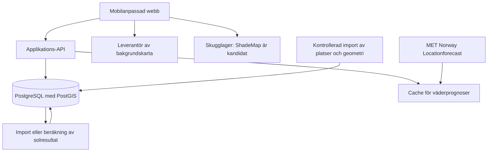

# Teknisk riktning

Status: arkitekturskiss för en framtida pilot. Den lokala prototypens enklare stack och implementerade API beskrivs i [versionsstatusen](10-prototypstatus.md). Inga molnresurser eller leverantörsavtal är låsta.

## Föreslagen struktur

En liten sammanhållen webbapplikation med serverdel räcker för användarflödena. PostgreSQL med PostGIS är ett föreslaget val för platser och geometri. Ramverk, driftmiljö och beräkningsbibliotek väljs efter datatestet. Ingen särskild hostingplattform behövs för att fatta produktbesluten.

Återanvänd ShadeMap där datatestet visar att det fungerar. Kartlagret kan renderas i klienten, medan solfönster för platskort och rankning behöver stabila resultat oberoende av kamerans utsnitt. Tung import och eventuell egen skuggberäkning körs som separata bakgrundsjobb. Förberäkning eller lagring av leverantörsresultat förutsätter stöd i gränssnitt och villkor; inget server-API från ShadeMap är ännu verifierat.

Väder hämtas via vår server och delas genom cache. Bevara leverantör, giltighetsintervall och källans uppdateringstid. Open-Meteo är endast ett möjligt alternativ, inte en beslutad parallell integration. Kartmotor och skuggmotor väljs separat; MapLibre med ShadeMap är en kandidat enligt [leverantörens integrationsöversikt](https://shademap.app/about/).

## Domänmodell

| Entitet | Centrala uppgifter |
| --- | --- |
| City | Namn, IANA-tidszon, pilotgräns, lokalt koordinatsystem. |
| Place | Namn, kategori, entré/position, källa, granskningsdatum och publiceringsstatus. |
| PlaceArea | Vistelsepolygon, vistelsehöjd, kopplad plats, källa, kvalitet och kända hinderluckor. |
| OpeningHours | Lokala scheman och undantag, om de gäller verksamheten eller ytan, källa och aktualitet. |
| GeometryDataset | Täckning, version, insamlingsdatum, koordinat- och höjdsystem, rättigheter samt referens till rasterfiler eller vektorgeometri. |
| SunSample | Yta, tidpunkt, areafraktion i sol, okänd andel och beräkningsversion. |
| SunWindow | Yta, start, slut, kvalitetsklass och referens till modell/dataset. |
| WeatherSnapshot | Prognoscell, giltighetsintervall, variabler/enheter, hämtningstid och tillgänglig modellmetadata. |
| Gathering | Aktivitet (`walk`, `bar`, `restaurant`), plats och yta, mötespunkt, UTC-start/slut, tidszon, värdens visningsnamn, text, version och status. |
| InviteAccess | Hashad delningsnyckel, träff, utgångstid och spärrstatus. |
| HostAccess | Separat hashad behörighet för att hantera träffen. |
| RSVP | Träff, gästidentifierare, visningsnamn, svar, besvarad planversion och hashad redigeringsbehörighet. |
| PlaceReport | Plats/yta, typ av fel, kort text, tidpunkt och granskningsstatus. |

Behörigheter och deltagaruppgifter får inte följa med i publika platsfrågor. En eventuell framtida kontomodell ska kunna kopplas till träffar utan att ändra solmodellens identiteter.

## Tid och versionshantering

Alla faktiska ögonblick lagras i UTC. Öppettider uttrycks lokalt och utvärderas mot platsens IANA-tidszon, `Europe/Copenhagen` för Köpenhamn. Träffens platslokala tid visas även för gäster som befinner sig i en annan tidszon.

Ogiltiga eller tvetydiga lokala tider vid sommartidsbyte ska upptäckas, inte tyst flyttas. Intervallets slut måste ligga efter dess början. Vald dag i kartan avser staden, inte telefonens tidszon.

Geometriska cacheposter beror på yta, datum, geometri-, algoritm- och tröskelversion. Väder sparas separat så att en prognosuppdatering inte kräver nya byggnadsskuggor. Ändrad yta eller hindermodell ogiltigförklarar berörda solresultat. Nya resultat publiceras atomärt så att en delvis misslyckad körning inte blandar versioner.

## Föreslagna gränssnitt

Detta är kontraktsförslag för målbilden; prototypen implementerar ett mindre urval med delvis andra sökvägar. Se `server/app.js` och versionsstatusen.

| Operation | Ansvar |
| --- | --- |
| `GET /places` | Avgränsat område, besöksintervall, kategori och filtrering; returnerar begriplig rangordning och täckningsstatus. |
| `GET /places/:id/sun-windows` | Yta, datum, geometriska fönster, separat väderreferens och kvalitet. |
| `POST /gatherings` | Skapar träff med servervaliderad aktivitet, plats/mötespunkt och tid; ger separata delnings- och värdbehörigheter. |
| `GET /invites/:token` | Läser delbar träffinformation och svarssummor efter kontroll av giltighet. |
| `PUT /gatherings/:id/rsvp` | Skapar eller ändrar eget svar med inbjudnings- respektive privat gästbehörighet. |
| `PATCH /gatherings/:id` | Ändrar eller ställer in med värdbehörighet; versionskontroll hindrar att samtidiga ändringar skrivs över. |
| `POST /places/:id/reports` | Tar emot en begränsad rapport för manuell granskning. |

Listfrågor behöver tak för område, tid och resultatmängd. Skrivningar behöver validering, begränsad textlängd och rate limiting. Om skapande eller svar skickas igen efter nätverksfel ska samma idempotensnyckel förhindra dubbletter.

## Privata träffar utan obligatoriska konton

Delningslänken är en innehavarbaserad behörighet: den som har länken kan läsa inbjudan och lämna ett svar. Den är därför inte en garanti för att bara avsedda vänner kan komma åt träffen. Förklaringen ska finnas nära delningen.

- Använd kryptografiskt slumpade nycklar med minst 128 bitars entropi; lagra bara hash på servern.
- Skilj alltid delningsnyckel, värdnyckel och gästens redigeringsnyckel åt.
- Undvik nycklar och fria meddelanden i loggar, analys och felrapporter. Privata sidor har ingen tredjepartsanalys och skickar ingen referrer.
- Byt vid behov nyckel i länk mot en säker sessionscookie och rensa adressen efter inläsning; privata API-svar får inte hamna i gemensam cache.
- Värden kan spärra en delningslänk, ta bort svar och radera träffen. En spärrad länk stoppar även nya svar via tidigare utdelad inbjudningsåtkomst.
- Svar är kopplade till planversion. En ändrad aktivitet, plats/mötespunkt eller tid gör äldre svar obekräftade, aldrig automatiskt godkända för den nya planen.
- Gäster ser svarssummor. Värden ser deltagarnamn och svar. Ingen exakt användarposition sparas för sociala funktioner.

Föreslagen retention är att inbjudan stängs sju dagar efter träffens slut och träff/deltagardata raderas ur primärlagringen efter 30 dagar. Värden kan radera tidigare. Backupretention och faktisk raderingstid måste fastställas före pilot. Detta är produktkrav för dataminimering, inte en genomförd juridisk bedömning.

## Drift och begränsningar

Väderfel får lämna geometriska solfönster tillgängliga med tydlig märkning. Saknad geometri ger okänt resultat. Kartfel får lämna listvyn användbar. En osäker plats göms inte tyst, men får inte få samma rekommendationsstatus som en kontrollerad plats.

Följ upp importfel, andel okända ytor, beräkningstid, prognosålder och fel i inbjudningsflödet. Föreslaget prestandamål för pilotens plats-API är p95 under en sekund med varm cache; detta är ännu inte uppmätt. Exakt plattform och kostnadsram fastställs när datatestet ger underlag.
